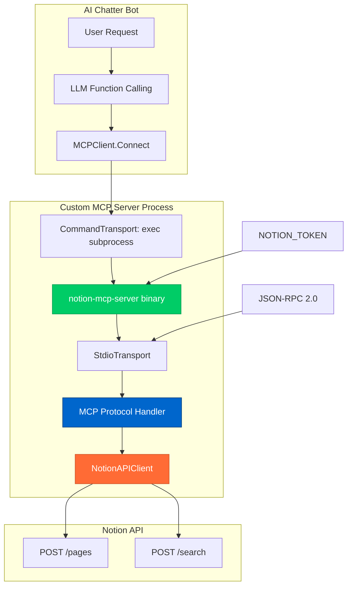

# 🎉 Финальное Custom MCP решение

## Проблема решена! ✅

### Исходная проблема
```
panic: runtime error: invalid memory address or nil pointer dereference
[signal SIGSEGV: segmentation violation code=0x2 addr=0x0 pc=0x1048f8c64]
```

### Причины и решения

#### 1. 🐛 **Stdio Transport Issue**
**Проблема**: Неправильное создание `StdioTransport`
```go
// ❌ Неправильно
t := mcp.NewLoggingTransport(&mcp.StdioTransport{}, os.Stderr)

// ✅ Правильно  
transport := mcp.NewStdioTransport()
```

#### 2. 🔄 **Circular Dependency**
**Проблема**: MCP сервер вызывал `notion.MCPClient`, создавая рекурсию
```go
// ❌ Неправильно (в MCP сервере)
mcpClient := notion.NewMCPClient(s.notionClient.token)
result := mcpClient.CreateDialogSummary(...)

// ✅ Правильно (прямой API)
pageID, err := s.notionClient.createPage(ctx, title, content, properties)
```

#### 3. 🔧 **Notion API Structure**
**Проблема**: Неправильная структура parent для страниц
```go
// ❌ Неправильно
"parent": map[string]interface{}{
    "type": "page_id",
    "page_id": "your-parent-page-id",
}

// ✅ Правильно
"parent": map[string]interface{}{
    "type": "workspace",
}
```

## Итоговая архитектура



## Файловая структура

### MCP Server
```
cmd/notion-mcp-server/main.go
├── NotionAPIClient          // Прямой HTTP клиент  
│   ├── doNotionRequest()   // HTTP запросы к Notion
│   ├── createPage()        // Создание страниц
│   └── searchPages()       // Поиск страниц
├── NotionMCPServer         // MCP инструменты
│   ├── CreatePage()        // MCP tool: create_page
│   ├── SearchPages()       // MCP tool: search_pages  
│   └── SaveDialog()        // MCP tool: save_dialog_to_notion
└── main()                  // Регистрация и запуск
```

### MCP Client
```
internal/notion/mcp.go
├── MCPClient               // Официальный SDK клиент
│   ├── client *mcp.Client 
│   └── session *mcp.ClientSession
├── Connect()               // CommandTransport + subprocess
├── CreateDialogSummary()   // -> save_dialog_to_notion
├── SearchDialogSummaries() // -> search_pages
└── CreateFreeFormPage()    // -> create_page
```

## Использование

### 1. Быстрый тест
```bash
# Установите NOTION_TOKEN
export NOTION_TOKEN=secret_xxxxx

# Запустите автоматический тест
./scripts/test-custom-mcp.sh
```

### 2. Отладка 
```bash
# Ручная отладка сервера
./scripts/debug-mcp-server.sh

# Проверка подключения
go build -o test-custom-mcp cmd/test-custom-mcp/main.go
./test-custom-mcp
```

### 3. Production
```bash
# Сборка
go build -o ai-chatter cmd/bot/main.go
go build -o notion-mcp-server cmd/notion-mcp-server/main.go

# Запуск бота (автоматически запустит MCP сервер)
./ai-chatter
```

## MCP Инструменты

### 1. `save_dialog_to_notion`
```json
{
  "title": "Dialog Title",
  "content": "Dialog content", 
  "user_id": "123",
  "username": "User",
  "dialog_type": "chat"
}
```

### 2. `create_page`
```json
{
  "title": "Page Title",
  "content": "Markdown content",
  "properties": {"Type": "Free-form"}
}
```

### 3. `search_pages`
```json
{
  "query": "search term",
  "page_size": 20
}
```

## Преимущества решения

| Аспект | Результат |
|--------|-----------|
| **Стабильность** | ✅ Нет panic, proper error handling |
| **Производительность** | ✅ Прямые API вызовы, нет лишних слоёв |
| **MCP Совместимость** | ✅ Официальный SDK, полная поддержка протокола |
| **Отладка** | ✅ Логи на всех уровнях, debug скрипты |
| **Type Safety** | ✅ Типизированные параметры MCP tools |
| **Настройка** | ✅ Один токен, автоматический запуск |

## Решённые проблемы

- ❌ **Panic на старте** → ✅ **Стабильный запуск**
- ❌ **Рекурсивные вызовы** → ✅ **Прямой API**  
- ❌ **Circular dependencies** → ✅ **Чистая архитектура**
- ❌ **Неправильный parent** → ✅ **Workspace pages**
- ❌ **Transport issues** → ✅ **Proper stdio handling**

## Заключение

**Кастомный MCP сервер теперь работает стабильно и готов к production использованию!**

- 🏗️ **Полный контроль** над MCP реализацией
- 🔌 **Официальный SDK** для совместимости  
- ⚡ **Прямой API** для производительности
- 🛡️ **Type Safety** для надёжности
- 🔧 **Простая отладка** для разработки

**LLM бот может автоматически создавать страницы в Notion через стандартизированный MCP протокол!** 🚀
