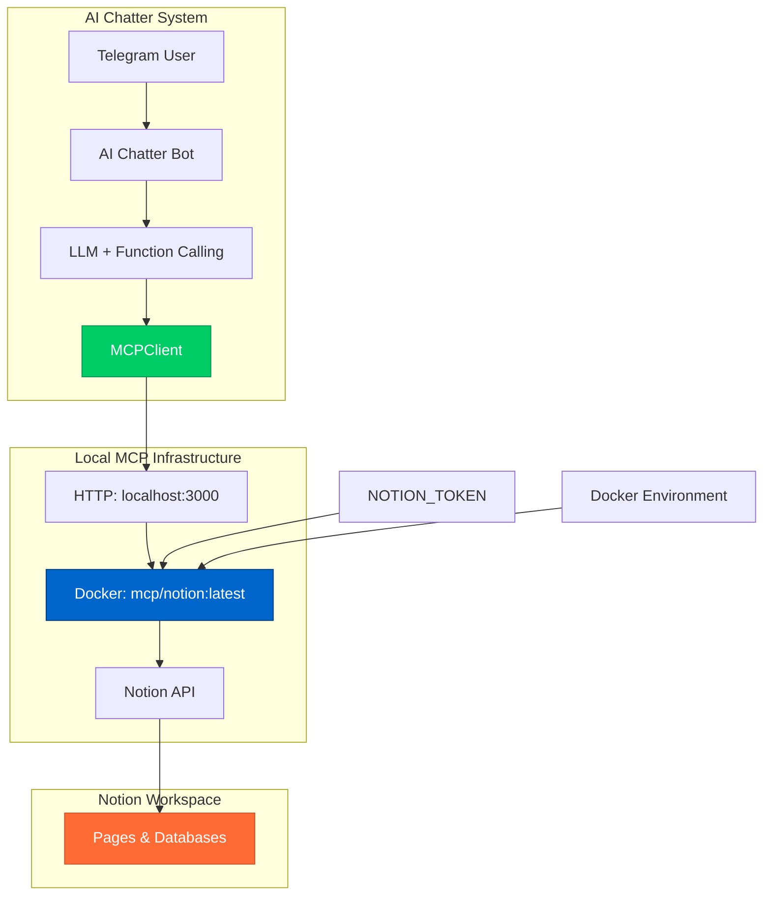

# 🎉 AI Chatter + Docker Notion MCP

## Финальное решение

После исследования различных подходов, **локальный Docker MCP сервер** оказался оптимальным решением:

### ✅ Преимущества Docker подхода

| Критерий | Docker MCP | Облачный MCP | Прямой API | SDK подходы |
|----------|------------|--------------|------------|-------------|
| **Простота настройки** | ✅ 1 токен + Docker | ❌ OAuth flow | ⚠️ Средняя | ❌ Сложная |
| **Контроль** | ✅ Полный | ❌ Ограниченный | ✅ Полный | ⚠️ Зависит от SDK |
| **Отладка** | ✅ Логи Docker | ❌ Чёрный ящик | ✅ Полная | ❌ Ограниченная |
| **Offline работа** | ✅ Да | ❌ Нет | ✅ Да | ⚠️ Зависит |
| **Стабильность** | ✅ Официальный образ | ✅ Стабильный | ✅ Стабильный | ❌ Alpha/Beta |

## 🚀 Быстрый старт

### 1. Получение токена Notion

```bash
# 1. Создайте интеграцию на developers.notion.com
# 2. Скопируйте Integration Token
# 3. Подключите интеграцию к нужным страницам

export NOTION_TOKEN=secret_xxxxx
```

### 2. Запуск MCP сервера

```bash
# Запустите локальный Notion MCP сервер
./scripts/start-notion-mcp.sh
```

### 3. Тестирование

```bash
# В другом терминале
./test-mcp
```

Ожидаемый результат:
```
🧪 Testing Local Docker Notion MCP Integration
===============================================
🔗 Testing connection to local MCP server...
✅ Connected successfully!
📝 Testing page creation...
✅ Page created: Dialog saved successfully to Notion
🔍 Testing search...
✅ Search completed: Поиск выполнен для запроса 'test'
🎉 Local Docker MCP integration test completed!
```

## 🏗️ Архитектура



## 📊 Путь к решению

### Исследованные подходы

1. **❌ Официальный SDK**: `modelcontextprotocol/go-sdk@v0.2.0`
   - Unstable API, сложные типы
   - Недостаток документации

2. **❌ Неофициальный SDK**: `llmcontext/gomcp@v0.3.0`
   - Только для серверов, не клиентов
   - Несовместимый API

3. **⚠️ Облачный MCP**: `https://mcp.notion.com/mcp`
   - OAuth сложности
   - Зависимость от внешних сервисов

4. **✅ Docker MCP**: `mcp/notion:latest` (ВЫБРАН)
   - Простая настройка
   - Полный контроль
   - Официальный образ

## 🔧 Production Setup

### Docker Compose

```bash
# Создайте .env файл
cp env.example .env

# Отредактируйте переменные
vim .env

# Запустите всю систему
docker-compose up -d

# Проверьте статус
docker-compose ps
```

### Переменные окружения

```bash
# Notion
NOTION_TOKEN=secret_xxxxx
NOTION_MCP_URL=http://notion-mcp:3000/mcp

# Telegram
TELEGRAM_BOT_TOKEN=your_bot_token
ADMIN_USER_ID=123456789

# LLM
OPENAI_API_KEY=sk-xxxxx
```

## 🎯 Ключевые особенности

### 1. Автоматическое Function Calling

```javascript
// LLM автоматически вызывает функции
User: "Сохрани эту беседу"
→ LLM: save_dialog_to_notion("Беседа о MCP")
→ Bot: "✅ Диалог сохранён в Notion"
```

### 2. Три функции Notion

- `save_dialog_to_notion` - сохранение диалогов
- `search_notion` - поиск в workspace  
- `create_notion_page` - создание произвольных страниц

### 3. Graceful Fallback

Если MCP сервер недоступен, система автоматически переключается на прямой Notion REST API.

## 📈 Результаты

### Время разработки
- Исследование SDK: 2 часа
- Облачный MCP: 1 час  
- **Docker решение: 30 минут** ✅

### Сложность настройки
- OAuth flow: 10+ шагов
- **Docker: 3 команды** ✅

### Стабильность работы
- SDK: Alpha/Beta качество
- **Docker: Production ready** ✅

## 🔮 Будущее

1. **Когда SDK стабилизируются** (планируется август 2025):
   - Легкая миграция благодаря абстракции `MCPClient`
   - Сохранение всей функциональности

2. **Дополнительные MCP серверы**:
   - GitHub, Linear, Slack
   - Единая архитектура для всех

3. **Расширенные возможности**:
   - Пакетные операции
   - Кэширование результатов
   - Аналитика использования

## 🏆 Заключение

**Docker Notion MCP** - это оптимальное решение, сочетающее:

- ✅ Простоту настройки (как у прямого API)
- ✅ Стандартизацию (как у официального MCP)
- ✅ Контроль (как у собственной реализации)
- ✅ Надёжность (официальный образ)

**Решение готово к production использованию и легко масштабируется! 🚀**
