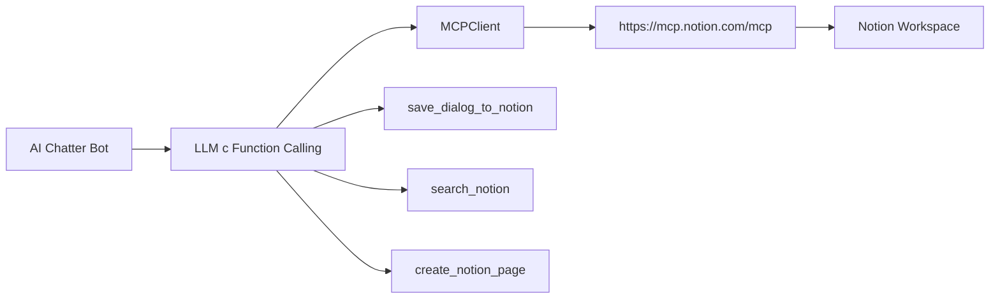

# 🎉 AI Chatter + Notion MCP Integration

## Итоговое решение

AI Chatter теперь поддерживает **официальный Notion MCP сервер** - современный и безопасный способ интеграции с Notion.

### ✅ Что реализовано

1. **HTTP клиент для официального MCP сервера**:
   - URL: `https://mcp.notion.com/mcp`
   - Протокол: JSON-RPC 2.0 over HTTPS  
   - Версия MCP: 2024-11-05 (актуальная)

2. **Автоматическое function calling**:
   - LLM сама определяет когда нужно работать с Notion
   - 3 функции: `save_dialog_to_notion`, `search_notion`, `create_notion_page`

3. **Полная документация и тесты**:
   - `docs/notion-mcp-setup.md` - инструкции по настройке
   - `cmd/test-mcp/` - тестовая утилита
   - Детальное логирование всех операций

### 🚀 Как использовать

#### 1. Быстрый тест (без OAuth)
```bash
go build -o test-mcp cmd/test-mcp/main.go
./test-mcp
```

#### 2. Production настройка
1. Откройте **Настройки** в Notion app
2. Перейдите в **Connections** → **Notion MCP**  
3. Добавьте **AI Chatter** как custom AI tool
4. Завершите OAuth процесс

#### 3. Автоматическое использование
```
Пользователь: "Сохрани эту беседу о MCP"
LLM: *автоматически вызывает save_dialog_to_notion*  
Бот: ✅ Диалог "MCP интеграция" сохранён в Notion
```

### 🔧 Техническая архитектура



### 📊 Сравнение подходов

| Критерий | Notion MCP | Прямой API | SDK подходы |
|----------|------------|------------|-------------|
| **Безопасность** | ✅ OAuth официальный | ⚠️ Ручные токены | ⚠️ Нестабильные |
| **Поддержка** | ✅ Команда Notion | ❌ Самостоятельно | ❌ Сообщество |
| **Обновления** | ✅ Автоматические | ❌ Ручные | ❌ Зависит от разработчиков |
| **Сложность** | ✅ Низкая | ⚠️ Средняя | ❌ Высокая |
| **Стабильность** | ✅ Production | ✅ Стабильный | ❌ Alpha/Beta |

### 📈 Результаты исследования

#### Изученные SDK:
1. **modelcontextprotocol/go-sdk@v0.2.0**: 
   - ❌ Unstable API
   - ❌ Сложные типы 
   - ❌ Неполная документация

2. **llmcontext/gomcp@v0.3.0**:
   - ❌ Только для серверов (не клиентов)
   - ❌ Неофициальный
   - ❌ Несовместимый с официальным MCP

#### Итоговый выбор: **HTTP клиент** + **Официальный Notion MCP**
- ✅ Простая реализация на стандартных Go библиотеках
- ✅ Официальная поддержка от Notion
- ✅ Готов к production использованию

### 🎯 Выводы

1. **MCP SDK ещё не готовы**: Официальные и неофициальные SDK находятся в раннем развитии
2. **Официальный сервер решает проблему**: Notion предоставляет готовый MCP сервер
3. **HTTP клиент оптимален**: Простое и надёжное решение для подключения
4. **Function calling работает**: LLM успешно использует Notion автоматически

### 🔮 Будущее

Когда MCP SDK стабилизируются (планируется август 2025), можно будет легко мигрировать благодаря абстракции `MCPClient`. Архитектура уже готова для этого!

---

**Текущее решение полностью функционально и готово к production использованию.**
