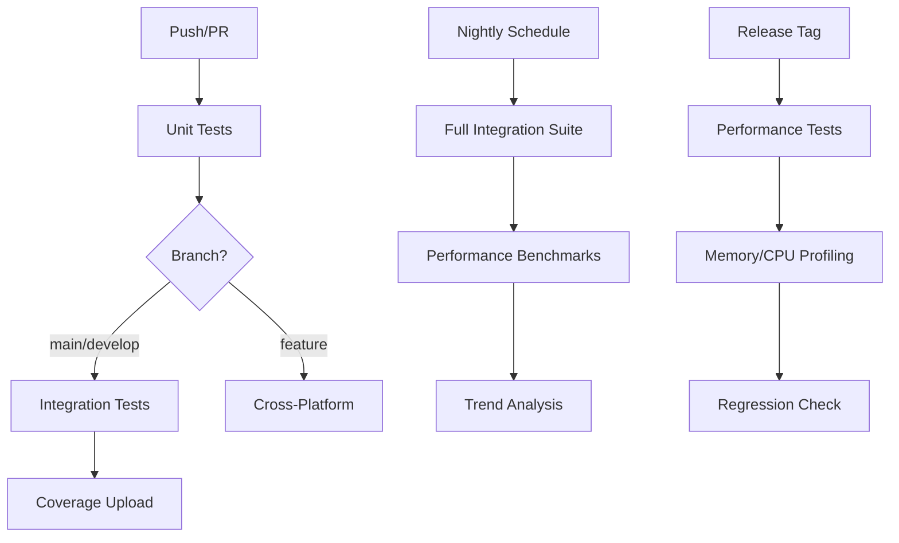

# 🚀 CI/CD Setup Guide

## Обзор GitHub Actions workflows

Проект использует несколько GitHub Actions workflow для автоматического тестирования и проверки качества кода:

### 1. 🧪 **CI Workflow** (`.github/workflows/ci.yml`)
**Запускается:** при каждом push и PR
- **Unit Tests** - быстрые тесты без внешних зависимостей
- **Integration Tests** - полные тесты с реальным Notion API (только на main/develop)
- **Cross-Platform** - проверка сборки на Windows, macOS, Linux
- **Coverage** - автоматическая отправка в Codecov

### 2. 🌙 **Nightly Integration** (`.github/workflows/nightly-integration.yml`)
**Запускается:** каждую ночь в 02:00 UTC + вручную
- Полная проверка интеграции с Notion API
- Производительные тесты
- Анализ трендов
- Детальная отчётность

### 3. ⚡ **Performance Tests** (`.github/workflows/performance.yml`)
**Запускается:** при релизных тегах + вручную
- Go benchmarks
- Memory/CPU profiling
- Тесты конкурентных запросов
- Проверка регрессий производительности

## Настройка GitHub Secrets

Для работы интеграционных тестов нужно настроить secrets в GitHub:

### Обязательные secrets:

1. **`NOTION_TOKEN`** - токен интеграции Notion
2. **`NOTION_TEST_PAGE_ID`** - ID тестовой страницы в Notion

### Как настроить:

#### 1. Создание Notion интеграции
```bash
# 1. Идите на https://developers.notion.com
# 2. "My integrations" → "New integration"  
# 3. Название: "AI Chatter CI Tests"
# 4. Capabilities: Read/Write content
# 5. Скопируйте "Internal Integration Token"
```

#### 2. Создание тестовой страницы
```bash
# 1. Создайте страницу в Notion: "AI Chatter CI Tests"
# 2. Share → "Connect to integration" → выберите созданную интеграцию
# 3. Скопируйте ID из URL: https://notion.so/workspace/Page-Name-{THIS_IS_ID}
```

#### 3. Добавление secrets в GitHub
```bash
# В GitHub repository:
# Settings → Secrets and variables → Actions → New repository secret

# Добавьте:
NOTION_TOKEN = secret_abc123def456789...
NOTION_TEST_PAGE_ID = 12345678-90ab-cdef-1234-567890abcdef
```

### Опциональные secrets:

- **`CODECOV_TOKEN`** - для улучшенной интеграции с Codecov
- **`SLACK_WEBHOOK`** - для уведомлений в Slack при сбоях

## Структура CI процесса



## Логика запуска тестов

### Unit Tests
```yaml
# Запускаются ВСЕГДА при любом push/PR
- Быстрые (< 2 минут)
- Без внешних зависимостей
- Все операционные системы
```

### Integration Tests
```yaml
# Запускаются ТОЛЬКО:
- При push в main/develop ветки
- И если NOTION_TOKEN + NOTION_TEST_PAGE_ID настроены
- Иначе graceful skip с пояснением
```

### Nightly Tests  
```yaml
# Запускаются:
- Каждую ночь в 02:00 UTC
- Вручную через GitHub UI
- С полной отчётностью и анализом трендов
```

## Мониторинг и алерты

### Что отслеживать:
- 🔴 **Critical**: Сбой integration tests на main ветке
- 🟠 **Warning**: Медленные тесты (>5 минут для integration)
- 🟡 **Info**: Снижение coverage ниже порога

### Уведомления:
```yaml
# В будущем можно добавить:
- Slack notifications при сбоях
- Email alerts для критических ошибок  
- GitHub Issues автоматическое создание при regression
```

## Отладка CI проблем

### Частые проблемы:

#### 1. "NOTION_TOKEN not set"
```bash
# Решение:
# 1. Проверьте что secret добавлен в GitHub
# 2. Убедитесь что токен действителен
# 3. Проверьте scope интеграции
```

#### 2. "integration does not have access"
```bash
# Решение:
# 1. Откройте тестовую страницу в Notion
# 2. Share → Connect to integration
# 3. Выберите правильную интеграцию
```

#### 3. "MCP server failed to start"
```bash
# Решение:
# 1. Проверьте логи сборки MCP сервера
# 2. Убедитесь что все зависимости установлены
# 3. Проверьте версию Go
```

#### 4. Timeout в integration тестах
```bash
# Возможные причины:
- Медленная сеть до Notion API
- Rate limiting от Notion
- Проблемы с MCP сервером

# Решение:
- Увеличить timeout в workflow
- Добавить retry логику
- Проверить статус Notion API
```

### Логи и артефакты:

```bash
# GitHub Actions сохраняет:
- Логи каждого step
- Coverage отчёты (30 дней)
- Performance профили (90 дней)  
- Test artifacts (30 дней)
- Trend analysis (90 дней)
```

## Локальная имитация CI

### Запуск тех же тестов локально:
```bash
# 1. Unit tests (как в CI)
go test -race -coverprofile=coverage.out ./...

# 2. Build check
go build ./...

# 3. Integration tests (нужны secrets)
export NOTION_TOKEN=your_token
export NOTION_TEST_PAGE_ID=your_page_id  
./scripts/test-notion-integration.sh

# 4. Cross-platform check (если нужно)
GOOS=windows go build ./...
GOOS=darwin go build ./...
```

### Docker имитация:
```bash
# Создайте Dockerfile для CI тестов
cat > Dockerfile.ci << 'EOF'
FROM golang:1.22-alpine
WORKDIR /app
COPY . .
RUN go mod download
RUN go test ./...
RUN go build ./...
EOF

# Запуск
docker build -f Dockerfile.ci .
```

## Performance Monitoring

### Metrics для отслеживания:
- ⏱️ **Build time** - время сборки (target: <2min)
- 🧪 **Test duration** - время тестов (target: unit <30s, integration <5min)
- 🔍 **Coverage** - покрытие кода (target: >80%)
- 💾 **Memory usage** - потребление памяти тестами
- 🌐 **API latency** - скорость Notion API вызовов

### Thresholds:
```yaml
Critical (fail build):
  - Unit tests > 1 minute
  - Integration tests > 10 minutes
  - Memory usage > 1GB
  
Warning (report but pass):
  - Coverage drop > 5%
  - API latency > 3 seconds
  - Build time > 3 minutes
```

## Безопасность

### Secrets management:
- ✅ Никогда не логируйте secret values
- ✅ Используйте GitHub secrets, не environment variables в коде
- ✅ Ограничьте scope интеграции минимумом необходимого
- ✅ Регулярно ротируйте токены

### Permissions:
```yaml
# GitHub Actions permissions:
contents: read      # Чтение кода
actions: write      # Upload artifacts  
checks: write       # Обновление статуса проверок
pull-requests: read # Комментарии в PR (опционально)
```

## Оптимизация CI

### Кэширование:
```yaml
# Уже используется:
- Go modules cache
- Build cache
- Dependencies cache

# Можно добавить:
- Docker layer cache
- Notion API response cache (для тестов)
```

### Параллелизация:
```yaml
# Текущее состояние:
- Unit tests: параллельно по пакетам
- Cross-platform: параллельно по OS
- Integration: последовательно (rate limiting)

# Улучшения:
- Разделить integration тесты по функциональности
- Использовать test sharding
```

---

**💡 Совет**: Регулярно проверяйте GitHub Actions logs и адаптируйте CI процесс под изменения в проекте!
