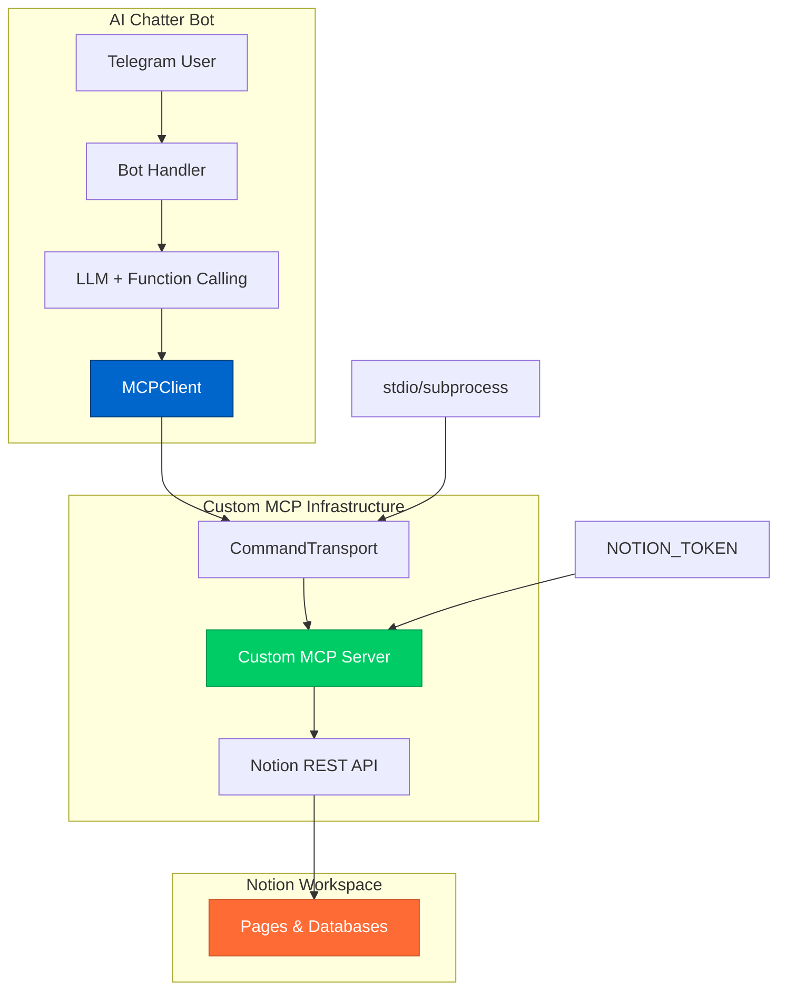

# 🏗️ Custom Notion MCP Server

## Обзор

**Кастомный MCP сервер** — это оптимальное решение, сочетающее все преимущества:

- ✅ **Официальный MCP SDK** — полная совместимость с протоколом
- ✅ **Нативная Go интеграция** — единая экосистема проекта  
- ✅ **Полная кастомизация** — контроль над каждым аспектом
- ✅ **Type safety** — строгая типизация параметров
- ✅ **Простая отладка** — прямой доступ к коду сервера

## Архитектура



## Быстрый старт

### 1. Создание Notion Integration

```bash
# 1. Создайте интеграцию на developers.notion.com
# 2. Скопируйте Integration Token
# 3. Подключите интеграцию к нужным страницам

export NOTION_TOKEN=secret_xxxxx
```

### 2. Сборка и тестирование

```bash
# Автоматическая сборка и тест
./scripts/test-custom-mcp.sh
```

**Ожидаемый результат:**
```
🧪 Testing Custom Notion MCP Server
===================================
✅ Connected successfully!
💾 Testing dialog saving...
✅ Dialog saved: Dialog 'Test Dialog from Custom MCP' saved to Notion
📄 Testing free-form page creation...
✅ Page created: Successfully created page 'Custom MCP Test Page' in Notion
🔍 Testing search functionality...
✅ Search completed: Поиск выполнен для запроса 'test'
🎉 Custom MCP Server integration test completed!
```

### 3. Ручная сборка

```bash
# Сборка MCP сервера
go build -o notion-mcp-server cmd/notion-mcp-server/main.go

# Сборка основного бота
go build -o ai-chatter cmd/bot/main.go

# Тестирование
go build -o test-custom-mcp cmd/test-custom-mcp/main.go
./test-custom-mcp
```

## Структура проекта

### Кастомный MCP сервер

```
cmd/notion-mcp-server/main.go
├── NotionMCPServer struct
├── CreatePage() - создание страниц
├── SearchPages() - поиск по workspace  
├── SaveDialog() - сохранение диалогов
└── main() - регистрация инструментов
```

### Обновлённый клиент

```
internal/notion/mcp.go
├── MCPClient struct (с официальным SDK)
├── Connect() - запуск сервера как subprocess
├── CreateDialogSummary() - через save_dialog_to_notion
├── SearchDialogSummaries() - через search
└── CreateFreeFormPage() - через create_page
```

## Зарегистрированные инструменты

### 1. `save_dialog_to_notion`

**Параметры:**
```json
{
  "title": "Заголовок диалога",
  "content": "Содержимое диалога", 
  "user_id": "ID пользователя",
  "username": "Имя пользователя",
  "dialog_type": "Тип диалога"
}
```

**Использование:**
```go
result := client.CreateDialogSummary(ctx, title, content, userID, username, dialogType)
```

### 2. `create_page`

**Параметры:**
```json
{
  "title": "Заголовок страницы",
  "content": "Markdown содержимое",
  "properties": {
    "Type": "Free-form",
    "Created": "2024-01-15"
  },
  "parent_page": "Родительская страница (опционально)"
}
```

### 3. `search`

**Параметры:**
```json
{
  "query": "Поисковый запрос",
  "filter": {
    "property": "Type",
    "select": {"equals": "Dialog"}
  },
  "page_size": 20
}
```

## Преимущества разных подходов

| Критерий | Custom MCP | Docker MCP | Cloud MCP | Direct API |
|----------|------------|------------|-----------|------------|
| **Настройка** | ✅ Простая | ✅ Простая | ❌ OAuth | ⚠️ Средняя |
| **Кастомизация** | ✅ Полная | ⚠️ Ограниченная | ❌ Нет | ✅ Полная |
| **Type Safety** | ✅ Да | ❌ Нет | ❌ Нет | ✅ Да |
| **MCP совместимость** | ✅ Официальная | ✅ Да | ✅ Да | ❌ Нет |
| **Отладка** | ✅ Простая | ⚠️ Логи Docker | ❌ Сложная | ✅ Простая |
| **Offline работа** | ✅ Да | ✅ Да | ❌ Нет | ✅ Да |
| **Go интеграция** | ✅ Нативная | ❌ HTTP | ❌ HTTP | ✅ Нативная |

## Конфигурация

### Переменные окружения

| Переменная | Обязательная | Описание |
|------------|--------------|----------|
| `NOTION_TOKEN` | ✅ | Integration token от Notion |
| `NOTION_MCP_SERVER_PATH` | ❌ | Путь к серверу (по умолчанию: `./notion-mcp-server`) |

### Пример .env

```bash
# Notion
NOTION_TOKEN=secret_xxxxx

# MCP (опционально)
NOTION_MCP_SERVER_PATH=./notion-mcp-server

# Остальные настройки бота
TELEGRAM_BOT_TOKEN=your_telegram_token
ADMIN_USER_ID=123456789
OPENAI_API_KEY=sk-xxxxx
```

## Отладка и разработка

### Логирование MCP сервера

```bash
# Сервер автоматически логирует все операции
export NOTION_TOKEN=secret_xxx
./notion-mcp-server
```

### Ручное тестирование инструментов

```bash
# Тест сохранения диалога
echo '{"jsonrpc":"2.0","id":1,"method":"tools/call","params":{"name":"save_dialog_to_notion","arguments":{"title":"Test","content":"Test content","user_id":"123","username":"TestUser","dialog_type":"test"}}}' | ./notion-mcp-server
```

### Добавление новых инструментов

1. **Добавить параметры** в `cmd/notion-mcp-server/main.go`:
```go
type NewToolParams struct {
    Param1 string `json:"param1" jsonschema:"title=Param1,description=Description"`
}
```

2. **Реализовать handler**:
```go
func (s *NotionMCPServer) NewTool(ctx context.Context, session *mcp.ServerSession, params *mcp.CallToolParamsFor[NewToolParams]) (*mcp.CallToolResultFor[any], error) {
    // Ваша логика
}
```

3. **Зарегистрировать инструмент**:
```go
mcp.AddTool(server, &mcp.Tool{
    Name:        "new_tool",
    Description: "Description of new tool",
}, notionServer.NewTool)
```

## Production развёртывание

### Systemd сервис

```bash
# /etc/systemd/system/ai-chatter.service
[Unit]
Description=AI Chatter Bot with Custom MCP
After=network.target

[Service]
Type=simple
User=ai-chatter
WorkingDirectory=/opt/ai-chatter
ExecStart=/opt/ai-chatter/ai-chatter
Environment=NOTION_TOKEN=secret_xxx
Environment=TELEGRAM_BOT_TOKEN=your_token
Restart=always

[Install]
WantedBy=multi-user.target
```

### Docker альтернатива

```dockerfile
FROM golang:1.21-alpine AS builder
WORKDIR /app
COPY . .
RUN go build -o ai-chatter cmd/bot/main.go
RUN go build -o notion-mcp-server cmd/notion-mcp-server/main.go

FROM alpine:latest
RUN apk --no-cache add ca-certificates
WORKDIR /app
COPY --from=builder /app/ai-chatter .
COPY --from=builder /app/notion-mcp-server .
CMD ["./ai-chatter"]
```

## Заключение

**Кастомный MCP сервер** — это **лучшее из всех миров**:

- 🏗️ **Полная кастомизация** как у прямого API
- 🔌 **MCP совместимость** как у официальных решений
- 🚀 **Go интеграция** как у нативного кода
- 🛡️ **Type safety** для надёжности
- 🔧 **Простота отладки** для разработки

Это **production-ready решение**, которое легко расширяется и поддерживается!
