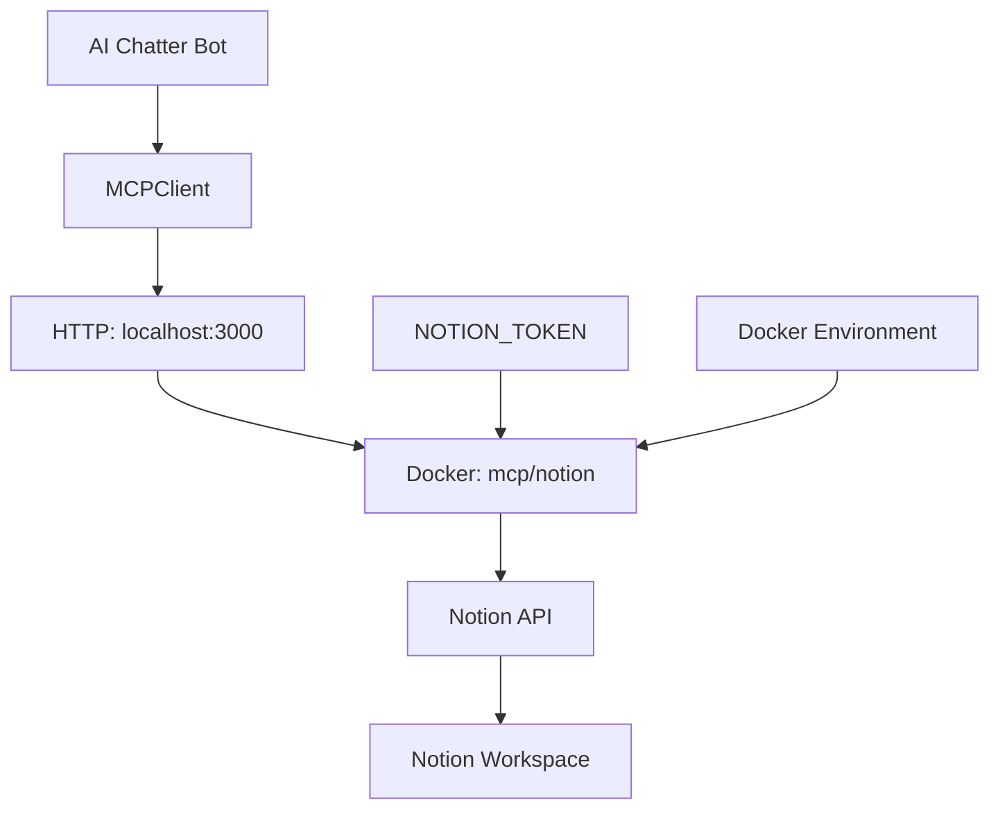

# 🐳 Docker Notion MCP Setup

## Обзор

Использование **локального Notion MCP сервера в Docker** предоставляет лучший баланс между простотой и контролем:

- ✅ **Нет OAuth сложностей** - используется прямой Notion Integration Token
- ✅ **Полный контроль** - сервер запускается локально
- ✅ **Официальный образ** - `mcp/notion:latest` от команды Notion
- ✅ **Работает offline** - не зависит от внешних сервисов

## Быстрый старт

### 1. Создание Notion Integration

1. Перейдите на [developers.notion.com](https://developers.notion.com/)
2. Создайте **New integration**
3. Скопируйте **Integration Token** (начинается с `secret_`)
4. В нужных страницах Notion: **Share** → **Connect to** → выберите вашу интеграцию

### 2. Запуск MCP сервера

```bash
# Установите токен
export NOTION_TOKEN=secret_xxxxx

# Запустите MCP сервер
./scripts/start-notion-mcp.sh
```

Сервер будет доступен на `http://localhost:3000`

### 3. Тестирование

```bash
# В другом терминале
go build -o test-mcp cmd/test-mcp/main.go
./test-mcp
```

## Docker Compose (для production)

### Запуск всей системы

```bash
# Создайте .env файл
cp env.example .env
# Отредактируйте .env файл с вашими токенами

# Запустите все сервисы
docker-compose up -d

# Проверьте логи
docker-compose logs -f
```

### Остановка

```bash
docker-compose down
```

## Ручной запуск Docker

Если предпочитаете ручной контроль:

```bash
# Запуск Notion MCP сервера
docker run --rm -i \
    --name ai-chatter-notion-mcp \
    -p 3000:3000 \
    -e "OPENAPI_MCP_HEADERS={\"Authorization\": \"Bearer $NOTION_TOKEN\", \"Notion-Version\": \"2022-06-28\"}" \
    mcp/notion:latest
```

## Конфигурация

### Переменные окружения

| Переменная | Обязательная | Описание |
|------------|--------------|----------|
| `NOTION_TOKEN` | ✅ | Integration token от Notion |
| `NOTION_MCP_URL` | ❌ | URL MCP сервера (по умолчанию: `http://localhost:3000/mcp`) |

### Пример .env

```bash
# Notion
NOTION_TOKEN=secret_xxxxx

# MCP
NOTION_MCP_URL=http://localhost:3000/mcp

# Telegram Bot
TELEGRAM_BOT_TOKEN=your_telegram_token
ADMIN_USER_ID=123456789

# LLM
OPENAI_API_KEY=sk-xxxxx
```

## Архитектура



## Устранение неполадок

### Проблема: "Connection failed"

**Причины:**
1. MCP сервер не запущен
2. Docker не установлен
3. Порт 3000 занят

**Решение:**
```bash
# Проверьте Docker
docker --version

# Проверьте порт
lsof -i :3000

# Запустите сервер
./scripts/start-notion-mcp.sh
```

### Проблема: "Invalid token"

**Причины:**
1. `NOTION_TOKEN` не установлен
2. Токен неверный
3. Интеграция не подключена к страницам

**Решение:**
```bash
# Проверьте токен
echo $NOTION_TOKEN

# Убедитесь что интеграция подключена к страницам в Notion
```

### Проблема: "Port already in use"

**Решение:**
```bash
# Найдите процесс на порту 3000
lsof -i :3000

# Остановите процесс
kill -9 <PID>

# Или используйте другой порт
docker run -p 3001:3000 ...
```

## Сравнение с другими подходами

| Критерий | Docker MCP | Облачный MCP | Прямой API |
|----------|------------|--------------|------------|
| **Настройка** | ✅ Простая | ❌ OAuth сложный | ⚠️ Средняя |
| **Безопасность** | ✅ Локальный контроль | ✅ OAuth | ⚠️ Управление токенами |
| **Зависимости** | 🐳 Docker | ☁️ Интернет | ❌ Нет |
| **Offline работа** | ✅ Да | ❌ Нет | ✅ Да |
| **Обновления** | ⚠️ Ручные | ✅ Автоматические | ❌ Ручные |

## Преимущества Docker подхода

1. **Простота настройки**: Один токен вместо OAuth flow
2. **Полный контроль**: Локальный сервер под вашим управлением  
3. **Debugging**: Доступ к логам и возможность модификации
4. **Надёжность**: Не зависит от внешних сервисов
5. **Безопасность**: Токены не покидают вашу машину

## Заключение

**Docker Notion MCP** - оптимальное решение для разработки и production, обеспечивающее баланс между простотой настройки и контролем над системой.
